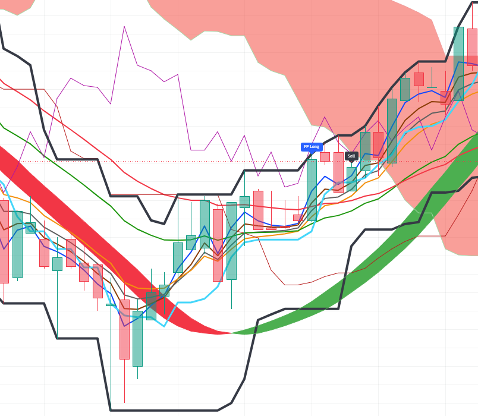

# Pine-Script-RSI-Ichimoku-BB-Merged-Indicator
Indicator based on RSI and conversion line from Ichimoku. Signals entry for long/short in futures for any cryptocurrency on Trading View.  

--

## Chart Preview

--

## Motivation & Problem

- **Market Noise & False signals**: The previous indicator showed entry signals too early, so it wasn't stable and trustworthy enough.
- **Exit timing**: Only having the entry signal didn't consider the exit timing. Trading is about placing orders and selling the position, so it was crucial to have an exit signal.  
- **The Core Goal**: To create an indicator that is stable and trustworthy by adding another indicator. Also include an exit signal. The system still implied the **multi-timeframe momentum confirmation** and the merging of different indicators, such as RSI and Ichimoku.

--

## Strategy Logic & Architecture

- This indicator avoids quick judgment that leads to false signals by utilizing a **rule-based, multi-factor filtering system**:

### Core Components:
1. **Trend Filter**:
   - Uses multiple moving averages (e.g., EMA 20) to determine macro trend bias.
   - Brings data from previous bars to compare the location of the EMA. Look for the cross on any of the EMAs and set the associated bool to true.
   - Conversion line from Ichimoku used to detect the short-term trend.
   - Bolinger Band added to check the average price in chosen lengths and compare them for improvement in trend analysis.

2. **Multi-Timeframe RSI**:
   - Instead of relying solely on local RSI, the script pulls RSI data from a higher timeframe using 'request.security()'
   - Confirms that macro momentum supports the local price action.

3. **Execution Rule**
   - **Bullish Signal**: Triggers when one of the small-lengthed EMAs crosses a longer-lengthed EMA upwards in a 3-minute timeframe **and** the conversion line has a slope greater than 0 **and** the RSIs from multi-timeframes are all sorted from least to greatest length above 55. It also needs the middle line of the Bollinger band (length 20) to face upwards, as well as 30. The BB middle line should also cross another BB middle line upwards.  
   - **Bearish Signal**: Triggers when one of the small-lengthed EMAs crosses a longer-lengthed EMA downwards in a 3-minute timeframe **and** the conversion line has a slope less than 0 **and** the RSIs from multi-timeframes are all sorted from greatest to least length below 45. It also needs the middle line of the Bollinger band (length 20) to cross downwards, as well as 30.  The BB middle line should also cross another BB middle line downwards.  

-- 

## Configurable Parameters

Users can adjust the following parameters inside TradingView's settings panel:

- **EMA Length**: Default - 3, 5, 7, 9, 20, 30. Lookback period for the moving average.
- **RSI Length**: Default - 7, 9, 12. Lookback period for RSI
- **Conversion Line Length**: Default - 7. Lookback period for conversion line.
- **Price Channel Length**: Defaul - 9. Lookback period for price channel.

--

## How to Install & Use in TradingView

1. Open any crypto chart (e.g., `BTC/USDT`) on **[TradingView](https://www.tradingview.com/)**.
2. Open the **`Pine Editor`** console at the bottom of the page.
3. Open `indicator.pine` from this repository, copy the source code, and paste it into the editor.
4. Click **`Save`** and then click **`Add to Chart`**.
5. Click the gear icon (`Settings`) on the indicator to adjust parameters as needed.

--

## Key Learnings & Engineering Reflections

1. **The Importance of Comparing a Few Different Lengths**
  - I learned that comparing two or more indicators that have the same calculations but different lookback lengths can actually help in filtering false signals. The trend change can be detected by comparing these indicators of different lengths. If they are all directed towards increasing, it is probably an increasing trend. 

2. **Data Collecting From Previous Bars**
   - I learned that comparing the current price and the previous price can help the indicator determine when to send out "sell" signals. If the current price is lower than before, the trend is likely "decreasing". By detacting change in the trend by comparing the current data with the previous data, we can send out more accurate sell signals. 
